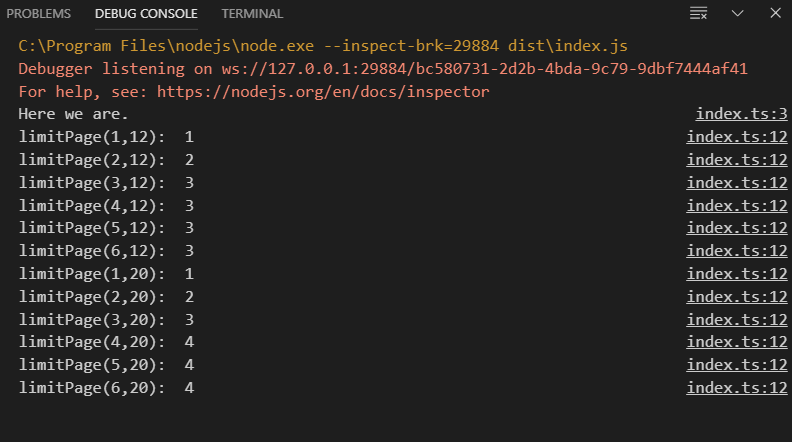

pagination limit || 总数的最大分页
=

当请求后端得到总数数据时，同时要更新最大分页，本文就是求最大分页的算法。

使用
--

`yarn`然后调试，结果如图示：

规律
--
 列数字找规律。取每页数量`LIMIT=5`。  

 可以发现，分页和总数与每页数目呈现错位对应，所以得到算法`p = Math.floor((c - 1) / LIMIT) + 1`

**注意：** 是`c-1`而不是`c+1`。

| 总数c | 最大分页p | c/LIMIT的商数 |
| ----- | --------- | ------------- |
| 0     | 1         | 0             |
| 1     | 1         | 0             |
| 2     | 1         | 0             |
| 3     | 1         | 0             |
| 4     | 1         | 0             |
| 5     | 1         | 1             |
| 6     | 2         | 1             |
| 7     | 2         | 1             |
| 8     | 2         | 1             |
| 9     | 2         | 1             |
| 10    | 2         | 2             |
| 11    | 3         | 2             |
| 12    | 3         | 2             |
| 13    | 3         | 2             |
| 14    | 3         | 2             |
| 15    | 3         | 3             |
| 16    | 4         | 3             |
| 17    | 4         | 3             |
| ...   | ...       | ...           |